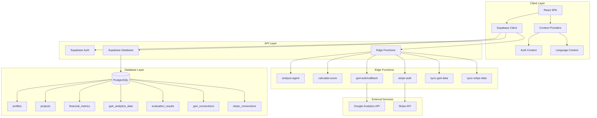

# AgentBoostr AI Score Hub - System Architecture Report

## Executive Summary

AgentBoostr AI Score Hub is a web application designed to evaluate and score AI agents/projects for investment potential. The system uses a modern tech stack with React frontend and Supabase backend, implementing a scoring algorithm to assess projects across multiple dimensions.

## System Overview

### Purpose
The platform enables users to:
- Submit AI agent projects for evaluation
- Connect Stripe and Google Analytics for data integration
- Receive comprehensive scoring and investment insights
- Compare projects on a leaderboard

### Architecture Type
- **Frontend**: Single Page Application (SPA)
- **Backend**: Backend-as-a-Service (BaaS) with Serverless Functions
- **Database**: PostgreSQL (via Supabase)
- **Deployment**: Static hosting for frontend, Supabase cloud for backend

## Technology Stack

### Frontend
- **Framework**: React 18.3.1 with TypeScript
- **Build Tool**: Vite 5.4.1
- **UI Components**: shadcn-ui (Radix UI primitives)
- **Styling**: Tailwind CSS 3.4.11
- **Routing**: React Router DOM 6.26.2
- **State Management**: React Context API
- **Data Fetching**: Direct Supabase client calls
- **Forms**: React Hook Form with Zod validation
- **Charts**: Recharts 2.12.7

### Backend
- **Platform**: Supabase
- **Database**: PostgreSQL 15
- **Edge Functions**: Deno-based serverless functions
- **Authentication**: Supabase Auth (JWT-based)
- **Real-time**: Not currently implemented
- **Storage**: Not currently utilized

### Infrastructure
- **Hosting**: Lovable.dev platform
- **CDN**: Built-in with hosting platform
- **Environment**: Development and Production configs

## System Architecture



## Core Components

### 1. Authentication System
- **Implementation**: Supabase Auth with email/password
- **Session Management**: JWT tokens stored in localStorage
- **Protected Routes**: HOC pattern with ProtectedRoute component
- **User Profiles**: Linked to auth.users via profiles table

### 2. Project Management
- **Creation Flow**: Form submission → Project record → Integration setup
- **Data Model**: Projects linked to metrics, analytics, and evaluations
- **Relationships**: One-to-many with financial and analytics data

### 3. Integration System
- **Stripe Integration**: OAuth flow for payment data access
- **GA4 Integration**: OAuth flow for analytics data access
- **Data Sync**: Scheduled functions to pull latest data (not fully implemented)

### 4. Scoring Engine
- **Algorithm**: Multi-dimensional scoring across 5 key areas
- **Scoring Dimensions**:
  1. User Value Realization (30 points)
  2. Product Market Fit (25 points)
  3. Technical Moat (20 points)
  4. Business Model Health (10 points)
  5. Execution Risk Assessment (15 points)
- **Grade System**: S/A/B/C/D based on total score
- **Percentile Ranking**: Relative performance against all projects

### 5. Data Visualization
- **Charts**: Line charts for metrics over time
- **Dashboards**: Project overview with key metrics
- **Leaderboard**: Ranked list of all projects

## Data Flow

### 1. Project Creation Flow
```
User Input → Create Project → Generate ID → Store in DB → Redirect to Integrations
```

### 2. Integration Flow
```
User Authorizes → OAuth Callback → Store Tokens → Trigger Data Sync → Update Metrics
```

### 3. Evaluation Flow
```
Trigger Analysis → Generate Mock Data → Calculate Scores → Store Results → Display to User
```

## Current Implementation State

### ✅ Implemented Features
1. **Authentication**: Full auth flow with Supabase
2. **Project CRUD**: Create and list projects
3. **UI Framework**: Complete component library setup
4. **Database Schema**: All tables and relationships defined
5. **Scoring Algorithm**: Complete calculation logic
6. **Basic Routing**: All main pages implemented
7. **Responsive Design**: Mobile-friendly layouts

### 🚧 Partially Implemented
1. **Stripe Integration**: OAuth flow exists but data sync incomplete
2. **GA4 Integration**: OAuth flow exists but data sync incomplete
3. **Internationalization**: Context exists but translations incomplete
4. **Data Visualization**: Charts implemented but limited data

### ❌ Not Implemented
1. **Real AI Analysis**: Currently using mock data generation
2. **Actual Data Sync**: No real data pulled from integrations
3. **User Onboarding**: No guided setup process
4. **Email Notifications**: No transactional emails
5. **Admin Dashboard**: No administrative interface
6. **API Rate Limiting**: No protection against abuse
7. **Data Export**: No way to export project data
8. **Team Collaboration**: Single user per project only

## Security Considerations

### Current Security Measures
- Row Level Security (RLS) enabled on all tables
- Service role key used only in Edge Functions
- CORS headers configured for Edge Functions
- Input validation with Zod schemas

### Security Gaps
- No rate limiting on API endpoints
- Tokens stored in plain text in database
- No encryption for sensitive data
- Missing security headers
- No audit logging

## Performance Characteristics

### Strengths
- Static asset caching via CDN
- Optimized database queries with views
- Lazy loading of route components
- Efficient component rendering

### Weaknesses
- No query result caching
- Multiple database calls per page
- Large bundle size (no code splitting)
- No image optimization

## Scalability Analysis

### Current Limitations
- Single region deployment
- No horizontal scaling for Edge Functions
- Database connection pooling limits
- No caching layer

### Growth Potential
- Supabase can scale to millions of rows
- Edge Functions auto-scale with traffic
- CDN handles static asset load
- Database can be upgraded as needed

## Recommendations for Architecture Improvements

1. **Implement Proper Data Integration**: Replace mock data with real API integrations
2. **Add Caching Layer**: Implement React Query for client-side caching
3. **Enhance Security**: Add rate limiting, encryption, and audit logging
4. **Improve Performance**: Implement code splitting and lazy loading
5. **Add Monitoring**: Integrate error tracking and performance monitoring
6. **Implement CI/CD**: Automated testing and deployment pipeline
7. **Add Documentation**: API documentation and developer guides
8. **Consider Microservices**: Split scoring engine into separate service for scale

## Conclusion

The AgentBoostr AI Score Hub has a solid foundation with modern technologies and clear architecture. However, it requires significant work to move from prototype to production-ready system, particularly in areas of real data integration, security hardening, and performance optimization.